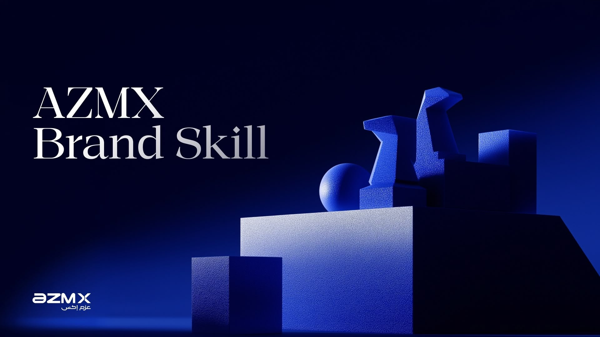

# AZMX Brand Skill

The official AZMX brand system, packaged as an Agent Skill for Claude Code and other AI agents. Install it once and every deliverable (decks, emails, reports, web pages, social graphics, documents) comes out in the AZMX identity without re-briefing the agent.

Deep navy, electric blue, generous white space, serif personality, the chevron as the only graphic device. Restraint is the luxury.

**[Browse the image library →](https://gamaleldientarek.github.io/azmx-brand-skill/)** — all 242 brand images, click any one to download. No account needed.

## What's inside

- `SKILL.md`: the condensed brand rules the agent loads automatically
- `references/design-system.md`: the full AZMX Design System handbook (v1.1: chevrons banned as backgrounds)
- `references/colors.md`: every color tone (primary, blue ramp 50 to 1000, neutrals, RAG, surfaces, text-by-surface)
- `references/figma-tokens.md`: the complete live Figma variable export, 233 tokens across Colors (with Dark Mode), Fonts, and Numbers (type scale, spacing, radii, opacity)
- `references/email-design-system.md`: the AZMX Email Design System v1 (RTL rules, 3-layer fonts, themes, components)
- `references/voice-and-tone.md`: how AZMX sounds, EN and AR, plus the no-AI-tells writing mechanics
- `references/image-library.md`: catalogue, selection rules, and measured colour pairings for the image library
- `references/image-index.md`: every image with its dominant colour, safe text colour, and a direct download link
- `references/recolor-prompts.md`: tested prompts for converting an image to another colour theme, copyable from the gallery
- `assets/images/`: 242 AZMX-generated brand images in 8 sections (gradients, abstract blue, and recolored variants)
- `assets/templates/`: ready-to-fill email skeleton and the full email component showcase
- `assets/logo/`: the AZMX logo in Colored, Navy Dark, and White SVG variants, plus the chevron favicon
- `assets/fonts/`: Azm X (TTF, English and Arabic) and thmanyah serif display (woff2 for web, OTF for desktop)
- `assets/fonts.css`: ready-made @font-face rules plus CSS variables for the palette

## Install (for AZMX team members)

You need [Claude Code](https://claude.com/claude-code) or any agent that supports Agent Skills.

```bash
npx skills add Gamaleldientarek/azmx-brand-skill -g
```

That's it. Next time you ask Claude for anything AZMX-branded, the skill kicks in automatically. You can also invoke it directly with `/azmx-brand`.

To update to the latest version later:

```bash
npx skills update azmx-brand
```

## Quick palette reference

| Token | Hex |
|---|---|
| Electric | `#001AFF` |
| Dark Navy | `#040038` |
| Light Blue | `#5D8FFF` |
| Blue 50 | `#F0F5FF` |
| Neutral 900 | `#111927` |

Full ramps and usage rules live in `references/colors.md`.

## Adding images to the library

Ask Claude ("add these to the AZMX image library"), or do it yourself from this folder:

```bash
python3 scripts/add-images.py blue ~/Desktop/new-renders/
git add -A && git commit -m "Add images to blue" && git push
```

Sections: `gradient`, `blue`, `white`, `orange`, `purple`, `red`, `green`, `yellow`. The script resizes to 1600px, compresses to match the set, numbers the files, and rebuilds both the index and the live gallery. Needs Pillow (`pip3 install Pillow`).

## License note

The AZMX logo, brand assets, and the thmanyah serif display and Azm X font files are the property of AZMX and its licensors, and are licensed for AZMX work only. Viewing this repo does not grant any right to use them in non-AZMX projects or to redistribute the fonts.

Built by [gamaleldien.com](https://gamaleldien.com). Design system v1.1, encoded from the New Direction Library Figma file.
